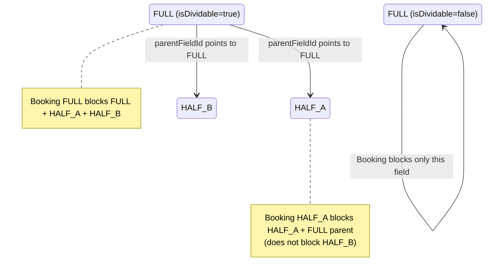
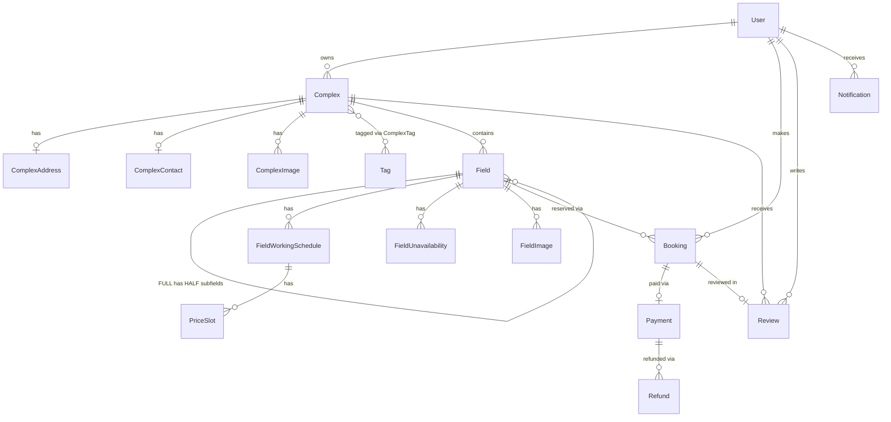

# 2. Domain Model

The domain is organized into three aggregate roots: **User**, **Complex**, and **Booking**.

## Complex Aggregate

A `Complex` represents a physical sports establishment. It contains geographic location (GeoJSON for spatial searches), its own timezone (critical for scheduling), cancellation policy, and features (parking, locker rooms, wifi, etc.).

Each complex has multiple `Field` entries. Each field has its own schedules (`FieldWorkingSchedule`) and prices (`PriceSlot`), not inherited from the complex. This allows a synthetic turf field with lighting to have different prices than an uncovered concrete one, even within the same complex.

The complex uses **soft delete** (`deletedAt`/`deletedBy`) instead of physical deletion, because historical bookings reference complex fields and must be preserved for legal and financial reasons.

## Divisible Fields Model

A field can be divisible: a full-size soccer field (FULL) can be split into two 5-a-side fields (HALF_A and HALF_B). This is modeled with a self-relation on `Field`:

**Conflict logic:** When searching bookings or checking availability, the relevant IDs are computed in memory:
- If the field is `FULL`: search in `[FULL, HALF_A, HALF_B]`
- If the field is `HALF_A` or `HALF_B`: search in `[HALF, FULL_parent]` (does not include the sibling)

## Booking Aggregate

A booking (`Booking`) links a user to a field for a specific time range. Key aspects:

- **UTC timestamps**: `startDateTime` and `endDateTime` are `Timestamptz`. They are absolute moments in time, independent of the complex's timezone. For display, they are converted using the complex's timezone with `date-fns-tz`.
- **Financial precision**: Amounts (`baseAmount`, `taxAmount`, `totalAmount`) use `Decimal(10,2)` in PostgreSQL and Prisma's `Decimal` class in TypeScript, avoiding floating-point errors.
- **Optimistic locking**: The `version` field prevents race conditions in concurrent bookings for the same slot.
- **Price breakdown**: Stored as JSONB for transparency and auditing.

Each booking can have an associated `Payment` (with external processor tracking) and multiple `Refund` entries (partial, full, or cancellation-based).

## Review Aggregate

Reviews are multi-dimensional: overall rating + specific ratings (facilities, service, cleanliness, value). The owner can respond (`ownerResponse`). The complex's aggregate ratings (`rating`, `reviewsCount`) are computed fields updated via triggers or jobs.

## Entity Diagram

---

← [Overview](./01-overview.md) | [Index](./README.md) | [Layers →](./03-layers.md)
