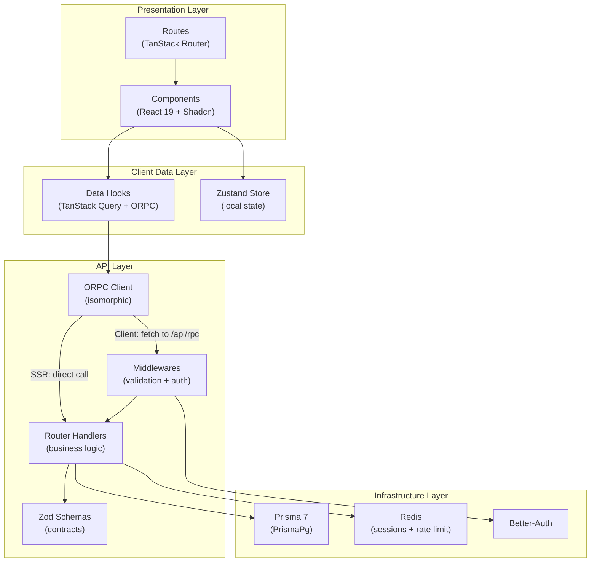

# 3. Layered Architecture

Dependencies flow top to bottom. No lower layer knows about upper ones.

## Routes (Presentation)

File-based routing via TanStack Router. Directory prefixes determine the access level:

| Prefix        | Access                        | Example                |
| ------------- | ----------------------------- | ---------------------- |
| `_general/`   | Public                        | `/`, `/about`, `/faqs` |
| `_customers/` | Customers only                | `/search`              |
| `_owners/`    | Owners only                   | `/dashboard`           |
| `_users/`     | Any authenticated user        | `/profile/*`           |
| `auth/`       | Public (unauthenticated)      | `/auth/sign-in`        |

## Data Hooks (Client Data)

Custom hooks in `src/data/` that wrap ORPC calls with TanStack Query. They provide:

- **Cache**: 5-minute stale time by default
- **Decoupling**: components are unaware of the RPC transport
- **Standardized states**: loading, error, data, refetch

## ORPC (API)

The core of client-server communication. Handlers contain business logic (price calculation, conflict detection, transactions). Zod schemas define input and output contracts. All responses are wrapped with `createApiResponseSchema()`, which adds `message`, `status`, and `data`.

## Infrastructure

- **Prisma 7** with the PrismaPg adapter (native PostgreSQL driver, not libSQL)
- **Redis** for session caching (avoids hitting PostgreSQL on every request) and rate limiting
- **Better-Auth** for authentication with multiple strategies

---

← [Domain Model](./02-domain-model.md) | [Index](./README.md) | [Data Flow →](./04-data-flow.md)
