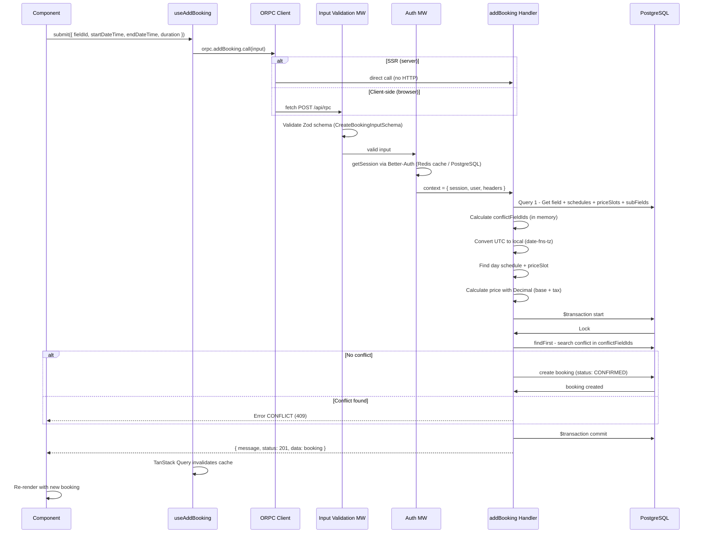
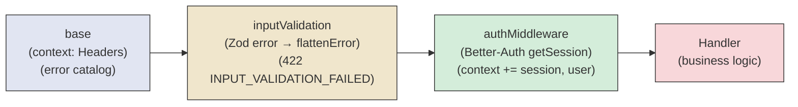

# 4. End-to-End Data Flow

## Example: Customer Creates a Booking



## Isomorphic Client

The key pattern that enables efficient SSR:

```typescript
// src/orpc/client.ts
const getORPCClient = createIsomorphicFn()
  .server(() => createRouterClient(router, { context: getRequestHeaders() }))
  .client(() => createORPCClient(new RPCLink({ url: '/api/rpc' })))
```

- **On server (SSR):** `createRouterClient` invokes handlers directly as functions, with no HTTP overhead. This is critical for first-load performance.
- **On client (browser):** `RPCLink` serializes the call and sends it as a fetch POST to `/api/rpc`.

Both paths share the same types and schemas, guaranteeing end-to-end type safety.

## Middleware Chain



**Composition:**

1. `base` — Defines the context type (`{ headers: Headers }`) and the error catalog (UNAUTHORIZED, BAD_REQUEST, NOT_FOUND, CONFLICT, FORBIDDEN, etc.)
2. `baseInputValidationMiddleware` — Intercepts Zod validation errors and reformats them with `z.flattenError()` for form-friendly responses
3. `authMiddleware` — Retrieves the session via `auth.api.getSession()` (checks Redis cache first, then PostgreSQL) and adds `session` + `user` to the context
4. `authorizedMiddleware` = `baseInputValidationMiddleware.use(authMiddleware)` — The final composition for protected endpoints

---

← [Layers](./03-layers.md) | [Index](./README.md) | [Auth →](./05-auth.md)
