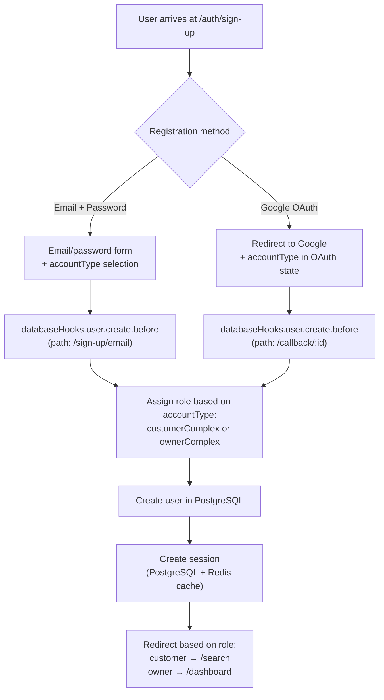
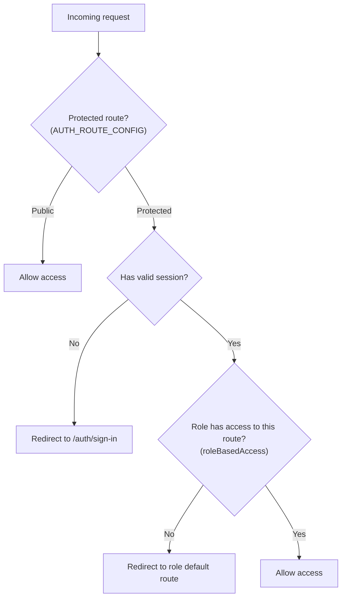

# 5. Authentication and Authorization

## Authentication Flow

**Key points:**
- The role is assigned **at registration time**, not after. The `databaseHooks.user.create.before` intercepts creation and assigns the role based on `accountType`.
- If `accountType` is not provided, registration fails (a user without a functional role cannot exist).
- Sessions are stored in PostgreSQL and cached in Redis with a 5-minute TTL (`cookieCache`). Sessions expire after 7 days and are renewed every 24 hours.

## Authorization Model (RBAC)

**Two levels of protection:**
1. **Route level** — `AUTH_ROUTE_CONFIG` defines which routes are protected and which roles can access them. Verified in TanStack Router's `beforeLoad`.
2. **API level** — `authorizedMiddleware` verifies the session on every protected ORPC call. Granular permissions (`complex: ['create', 'update', 'delete']`) are defined via Better-Auth's `createAccessControl`.

## Rate Limiting

Stored in Redis. Global configuration: 100 requests / 10 seconds. Custom rules for sensitive endpoints:
- `/sign-in/email`: 3 attempts / 10 seconds
- `/sign-up/email`: 3 attempts / 10 seconds

---

← [Data Flow](./04-data-flow.md) | [Index](./README.md) | [Key Decisions →](./06-key-decisions.md)
