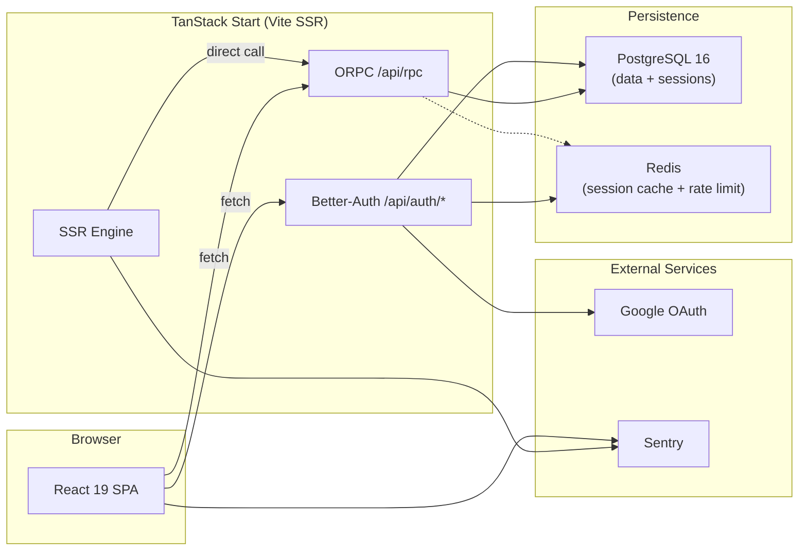

# 7. Infrastructure

## Local Environment

- **Docker Compose**: PostgreSQL 16 + Redis, configured via environment variables in `.env`
- **Env var validation**: `@t3-oss/env-core` + Zod in `src/env/server.ts` (server) and `src/env/client.ts` (client, `VITE_` prefix). If a variable is missing, the app won't start.

## Database

- **ORM**: Prisma 7 with the PrismaPg adapter (native PostgreSQL driver)
- **Generated client**: `generated/prisma/client` (configured in `prisma.config.ts`)
- **Indexes**: Optimized for the most common query patterns (location search, availability by field/date, bookings by user/status)

## Observability

- **Sentry**: Client-side initialization in `router.tsx`. Server-side with `Sentry.startSpan({ name: '...' })` wrapping ORPC handlers. Automatic error collection.

---

← [Key Decisions](./06-key-decisions.md) | [Index](./README.md) | [Glossary →](./08-glossary.md)
